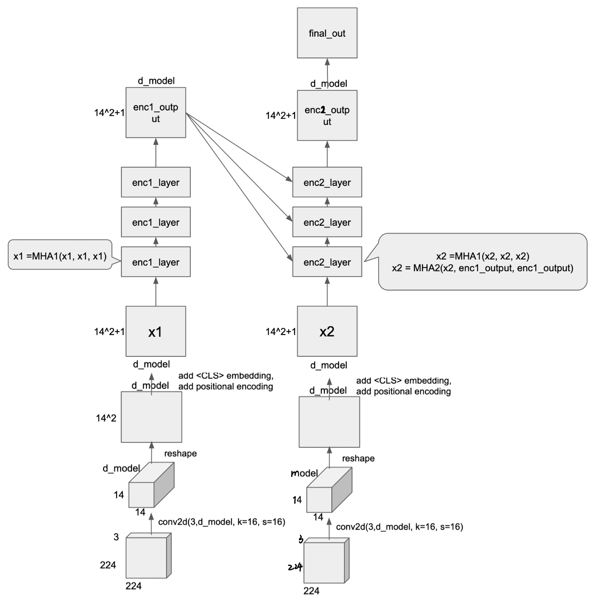
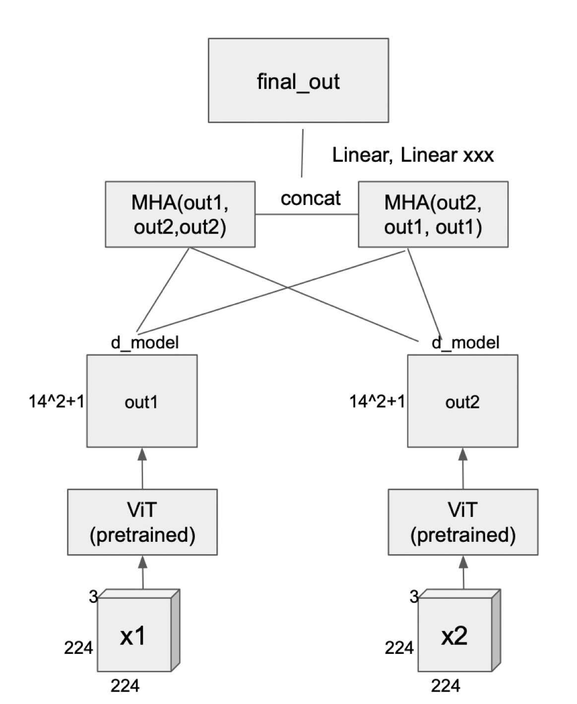
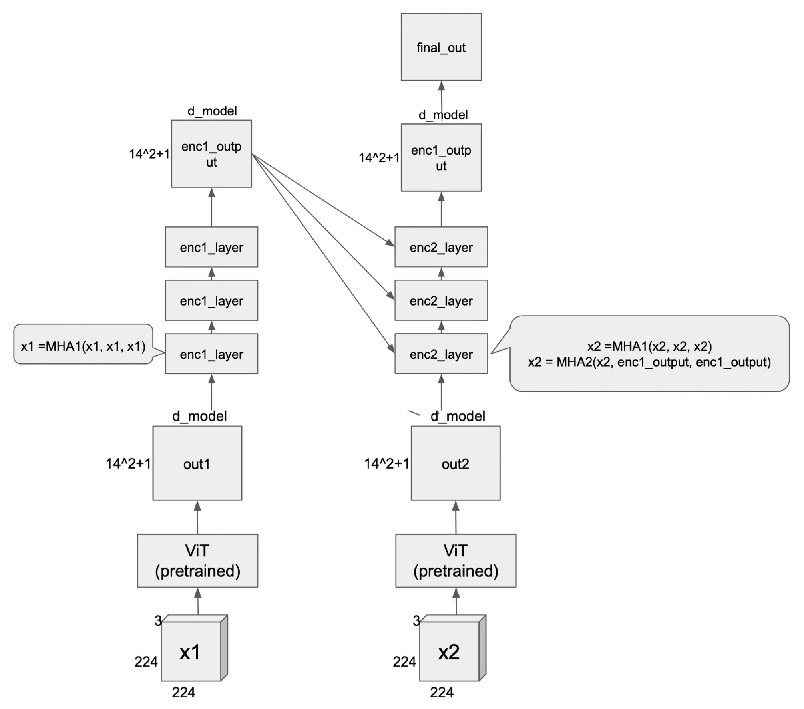

# CZ4041-kaggle
enc_dec: using encoder decoder architecture so that decoder has cross_attention with output from encoder

enc_both: using pretrained vit encoder for both images, add cross attentions on the encoded outputs, concatenate both followed by linear projection

enc_dec_on_top: since enc_dec architecture may be new (can't find pretrained weights), use original pretrained vit encoder for both images, add encoder decoder architecture on top of it with decoder having cross_attention with output from encoder

